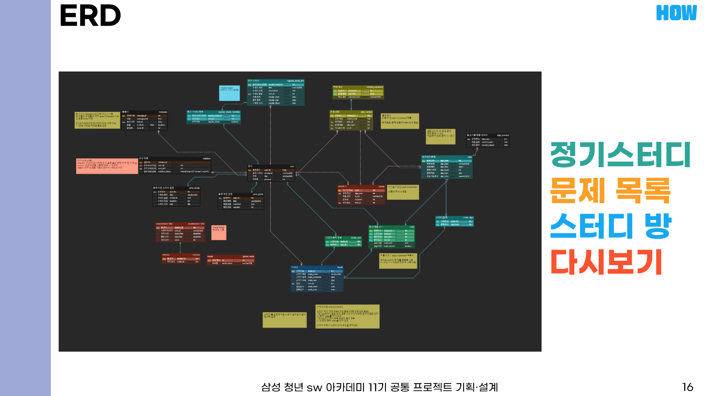
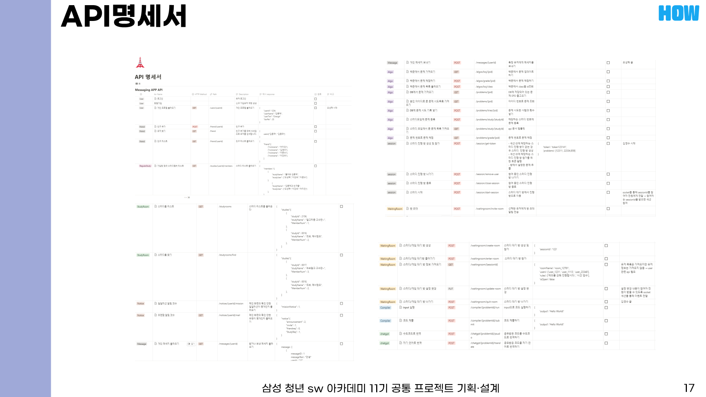

# (코)딩하는 사람 (끼)리 (스)터디

## ✅프로젝트 소개
- 프로젝트 기간: 2024-07-02 ~ 2024-08-16
- 서비스 소개: 알고리즘 스터디와 게임을 결합한 웹 컴파일러 기반 학습 플랫폼
- 도입 배경
    - 코딩 교육이 의무화되고 코딩 테스트 평가를 도입하는 기업이 들어나는 등 알고리즘 학습의 중요성이 대두되고 있음
    - 기존의 스터디 환경에서 느끼는 불편함들을 개선하여 보다 효율적인 알고리즘 학습 스터디 플랫폼에 대한 필요성을 느낌
- 목적
    - 알고리즘 학습과 Gamification 요소를 결합하여 학습 동기와 성과를 향상시키는 웹 기반 플랫폼을 만드는 것을 목표로 함

## ✅기술스택

## ✅아키텍처

## ✅화면 소개

### 메인 페이지

### 스터디 모집 게시판

### 문제 목록 페이지

### 스터디 대기 페이지

### 스터디 진행 페이지

### 게임 대기 페이지

### 게임 진행 페이지

### 로그인, 회원가입 페이지

## ✅산출물

### 요구사항 명세서

### 목업

### ERD

### API 명세서

## ✅기대 효과
- 기술적 기대효과
    - 화상회의, 웹 크롤링, 웹 컴파일러, 코드 공유를 융합함으로써 사용자 경험 개선
    - OpenAI API를 사용함으로써 즉각적인 피드백 가능
- 경제적 기대효과
    - 점진적으로 늘어가는 알고리즘 관심도와 비례하여 수익성 증가
    - 사용자 측면에서 온라인 스터디가 증가하여 스터디 비용 감소
- 사회적 기대효과
    - ssafy 후배들에서 배포함으로써 알고리즘 스터디의 질 향상
    - ChatGPT의 지속적인 코드 평가로 사용자들의 실력 향상
    - 게임적 요소를 넣어 스터디 유지력 상승

## 개발 환경
- Front-End
    - Vue.js 3.4.29
    - Vue-router 4.3.3
    - Pinia 2.1.7
    - Openvidu Browser 2.30.0
    - Npm 10.5.0
    - Node 20.12.2
    - Javascript
    - HTML5
    - CSS3
- Back-End
    - Java 17.0.12
    - Spring Boot 3.3.2
	- Spring data JPA 3.3.2
	- Spring Thymeleaf 3.3.2
	- Spring Web 3.3.2
	- Spring Web Services 3.3.2
	- Spring Websocket 3.3.2
	- Spring Webflux 3.3.2
	- Spring Mail 3.3.2
	- MyBatis 3.0.3
	- Jackson 2.16.1
	- Jsoup 1.15.3
	- Lombok 1.18.28
	- Openvidu-java-client 2.30.0
	- MySQL 8.0.37
    - JPA
    - Gradle
- Infra
    - Docker
    - Docker Compose
    - Openvidu 2.23.0
    - NginX
    - Ubuntu 22.04
    - Jenkins

## 개발 도구
- 이슈 관리
    - JIRA
- 형상 관리
    - Gitlab
- 커뮤니케이션 도구
    - Notion
    - Mattermost
- 디자인
    - Figma
- UCC
    - 프리미어 프로
- 개발 툴
    - VS Code 1.90.2
    - IntelliJ IDEA 2024.1.4
- 기타 툴
    - Postman 11.7.0

## ✅팀 소개

